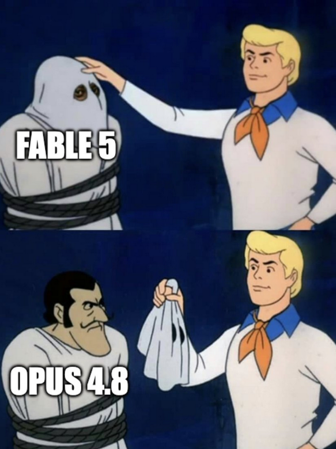

Anthropic przywrócił dostęp do modelu Fable 5. [Po ponad trzech tygodniach nieobecności tego modelu](https://neuronowa.pl/posts/fable-i-mythos-niedostepne-zarzadal-tego-rzad-usa/) Rząd USA zniósł ograniczenia i znów model jest dostępny. Nie ma jednak żadnej wzmianki odnośnie Mythos (na razie).

Przy czym nie jest to już ten sam model, co wcześniej. Oczywiście wprowadzono ograniczenia zabezpieczające przed wykorzystaniem go od doniecnych celów. Ale co więcej, najbardziej szokująca jest wiadomość, jaka pojawiła się we wpisie na Twitterze z oficjalnego konta twórców. [Otóż jawnie oni przyznają](https://x.com/AnthropicAI/status/2072163884430229756), że jeśli chcemy użyć tego modelu do programowania albo do debugowania, automatycznie on przełączy się na starszą i słabszą wersję, czyli Opus 4.8.

