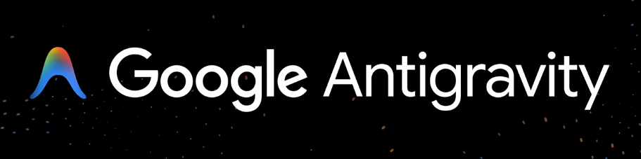

Wczoraj Google [zaprezentowało nową wersję ich modelu Gemini oznaczoną cyfrą 3](https://blog.google/products/gemini/gemini-3/#gemini-3-deep-think) I wg benchmarków jest o wiele lepszy od wersji poprzedniej. 

Od razu zaprezentowano też nowe IDE, czyli edytor dla programistów z wbudowanym tym modelem. Nazywa się Google Antigravity i [do pobrania jest za darmo z ich strony](https://antigravity.google/).

[](https://antigravity.google/)

Zainstalowałem. Początkowy wizard jest przyjemny: pyta o import danych z innego IDE - vscode lub cursor, na co wybrałem Cursor jako, że jest on moim domyślnym edytorem. W dlaszych krokach istotne jest to, że prosi o zalogowanie się na konto Google. 

Po uruchomieniu interfejs zdradza to, czego można się było spodziewać: to kolejna odmiana edytora bazująca na vscode właśnie, podobnie jak cursor czy windsurf. 

Po wczytaniu repo z tą stroną, którą właśnie czytacie (projekt w Astro.js) edytor pierwsze co zrobił to zgłosił, że został niespodziewanie zakończony i czy ma wysłać raport do Google. Zgodziłem się, choć żadnej wywrotki nie widziałem.

Choć obiecałem Wam, że wpisy będę tworzyć zawsze ręcznie, postanowiłem sprawdzić jak się sprawuje te IDE pozwalając jej na dodanie obrazka do tego wpisu. Cały prompt jakiego użyłem to:

```
weź te obrazek dołącz do wpisu @google-antigravity.md 

zrób to tak jak jest we wpisie @src/content/posts/showing-off-blog-features 
```

I dołączyłem obrazek z logo Google Antigravity.

Edytor pomyślał jakieś 10 sekund po czym wyświetlił mi...

> Model quota limit exceeded
> You have reached the quota limit for this model.

No cóż... 

Ale obrazek (wyżej) załączam Wam ręcznie.

**Update** Z tego co ludzie donoszą, problem z przekroczeniem quota, to nie jest problem po stronie użytkowników: zainteresowanie Gemini 3 i edytorem Antigravity jest tak duże, że to serwery Google odmawiają posłuszeństwa, a edytor interpretuje to jako wyczerpany limit.
