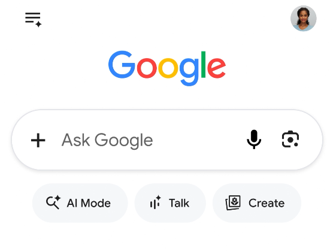
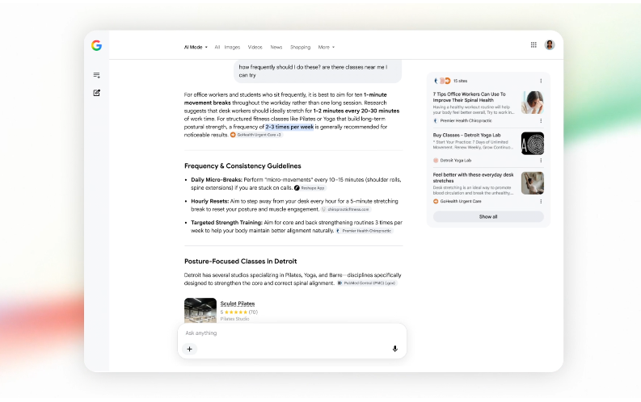

Google po raz pierwszy od 25 lat [zmienia](https://blog.google/products-and-platforms/products/search/search-io-2026/) tak drastycznie swoje pole wyszukiwania w wyszukiwarce. Oczywiście całość by było bardziej zintegrowane z ich produktem AI czyli Gemini.

Od teraz to nie będzie pole wyszukiwania, a pole pytania. To znaczy już teraz gdy szukaliśmy coś w Google na górze mieliśmy najpierw odpowiedź od Gemini a dopiero poniżej wyniki z sieci. Teraz wyniki z sieci mogą się już w ogóle nie pojawiać.

Wyniki wyszukiwania schodzą na drugi plan, dosłownie: będą pokazywane w panelu bocznym, a główne miejsce zajmie odpowiedź konwersacyjna. Wszystko wciąż jednak będzie zależeć od kontekstu: jeśli Gemini zrozumie, że zależy nam na zobaczeniu jakiejś strony czy wyników z sieci, będą one bardziej wyeksponowane. Tak samo jeśli zauważy że szukamy jakiegoś produktu czy usługi, od razu nam zaprezentuje ich kartę produktową i nawet umożliwi zakup.

Czy to dobry ruch? Dla odwiedzających, na pewno. Dla samego Google, na tę chwilę raczej tak: biorą udział w wyścigu o dominację na rynku AI, więc koszta się nie liczą (a taki ruch na pewno wpłynie na przychód z reklam negatywnie). Dla twórców stron: nie łudźmy się - moment [Google Zero](https://www.theverge.com/24167865/google-zero-search-crash-housefresh-ai-overviews-traffic-data-audience) czyli chwila w której Google już nie przekierowuje na inne strony nikogo jest jeszcze bliżej.
