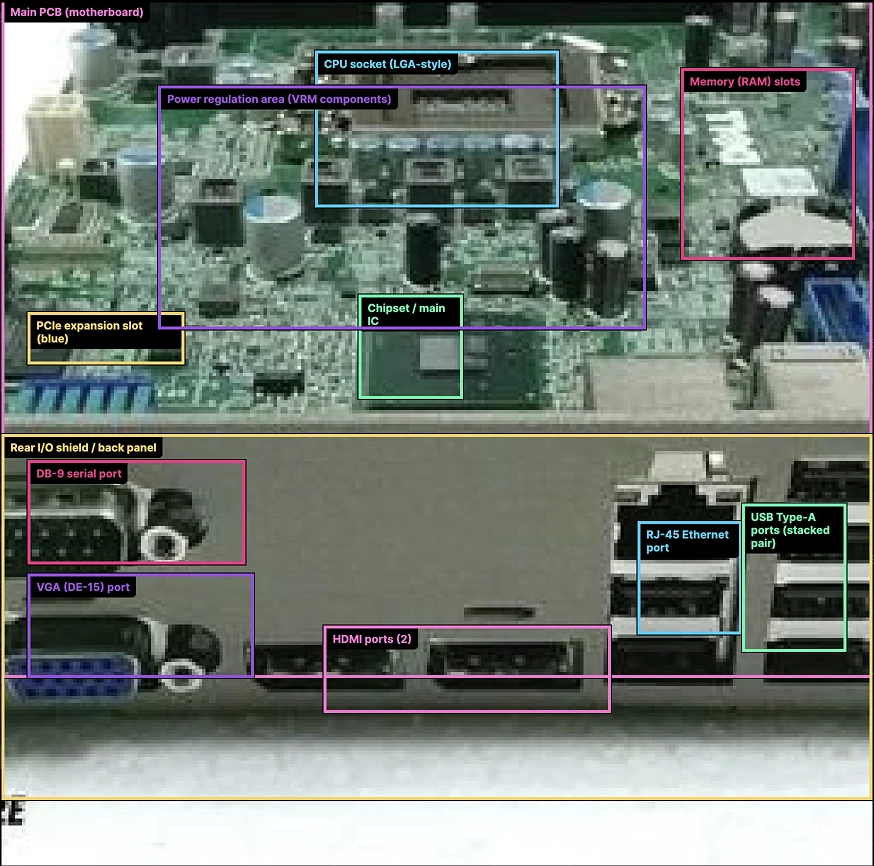
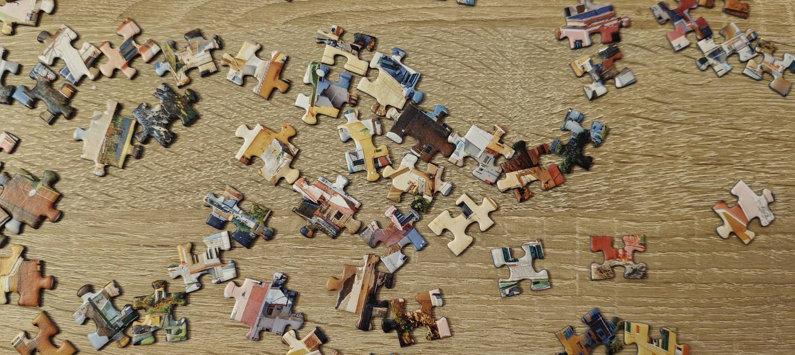
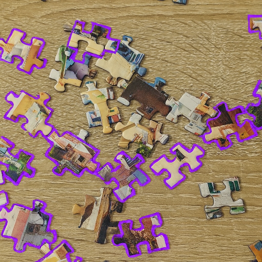

OpenAI pali się grunt pod nogami, a to na skutek zyskującego coraz większą popularność Gemini od Google. Już podobno niemal połowa użytkowników czatów Ai korzysta właśnie z produktu Google. Nic dziwnego, bo ten jest nam wpychany na siłę wszędzie. Google zapewne dostanie tu kary za praktyki monopolistyczne, bo sytuacja przypomina kwestię Internet Explorer vs Netscape, ale Alphabet wydaje się tym nie przejmować - wojna jest na tyle ważna, że trzeba ją wygrać.

Ale wróćmy do OpenAI. Podobno teraz to oni ogłosili _red alert_ i pracują w trybie na sterydach, by nie stracić rynku (tai sam alert ogłaszał Google jak na rynku pojawił się ChatGPT, a Google okazało się, że przesypia rewolucję). Pracownicy zostali rzuceni do pracy z najwyższą intensywnością, a ChatGPT, choć był planowany na premierę za kilka tygodni [pokazał się w tygodniu ubiegłym](https://openai.com/pl-PL/index/introducing-gpt-5-2/).

Premiera była taka sama jak wszystkie inne u wszystkich producentów: "przedstawiamy najnowszy model, który jest lepszy od poprzedniego i lepszy od wszystkich innych. Oto kilka wykresów i tabelek by pokazać Wam jak jest wspaniale. Macie tu jeszcze przykład z obrazkiem i rozpoznawaniem obiektów".

I tu właśnie nastąpił fail. Jak zauważyli użytkownicy HackerNews, ChatGPT poproszony o identyfikację elementów płyty głównej dość pewnie pozaznaczał w ramki jej poszczególne elementy:

Sęk w tym, że niemal wszystko jest źle: już na pierwszym planie owe porty to nie HDMI a DisplayPort a im dalej tym jest gorzej.

Pracownik OpenAi zaczął najpierw się tłumaczyć, że tak miało być, bo specjalnie wybrali takie zdjęcie by pokazać, że AI potrafi popełniać błędy (serio? w artykule, w którym rozpisali się jaki to jest niemal nieomylny), a ostatecznie zdjęcie zostawili i zmienili opis tak by już nie mówić jak cudowne jest obrazów generowanie.

Dziś układałem puzzle z synem i postanowiłem zrobić podobny test. Wrzuciłem do ChataGPT ten obrazek:

I poprosiłem by pomógł mi znaleźć kawałki, które stanowią brzeg obrazka, więc mają jedną krawędź prostą.

(Spoiler alert: nie ma tu takich kawałków)

ChatGPT myślał dość długo i zwrócił mi taki wynik:

Mówię wam: [dochodzimy do technoligicznej ściany dla językowych modeli](https://neuronowa.pl/posts/nadciaga-zima-ai/) a krach jest blisko.

