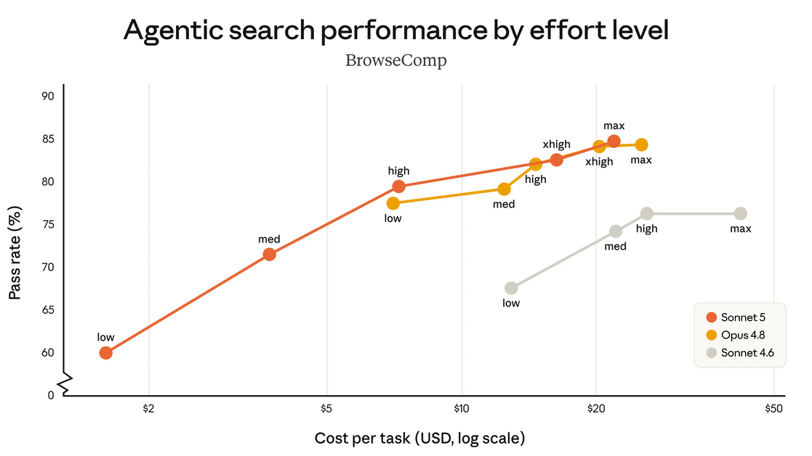

Anthropic udostępnił kolejną wersję swojego modelu Sonnet oznaczoną numerem 5. Oczywiście jest sprawniejsza od poprzedniej wersji i tańsza, ale z małą gwiazdką.

Anthropic zachęca, żeby korzystać z niej zamiast z Opusa jako tańszej alternatywy. Faktycznie ta wersja modelu już prawie dościga wersję maksymalną jaką w tej chwili jest Opus. Jeśli natomiast chodzi o koszty, to wszystko zależy od "effort".

Spójrzcie na ten wykres:

Pomarańczowy Sonnet 5 jest właściwie niemal zawsze tańszy niż jego poprzednik, czyli Sonnet 4.6 zaznaczony na szaro. I jest tańszy niż Opus 4.8, zaznaczone na żółto.

Ale zwróćcie uwagę, kiedy staje się droższy: gdy tylko intensywność Sonnet 5 wskakuje na high, to od razu staje się droższy niż najsłabsza wersja Opus.

Nie ma więc sensu używać sonetta w wersjach intensywnych: Gdy tylko zadanie będzie wymagać dużej precyzji i "siły umysłu", lepiej skorzystać już wtedy z Opusa.

